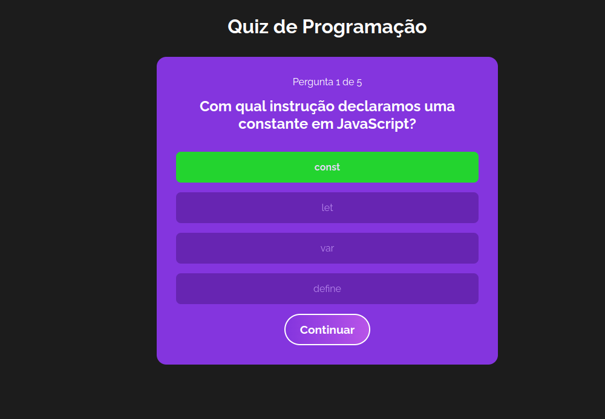
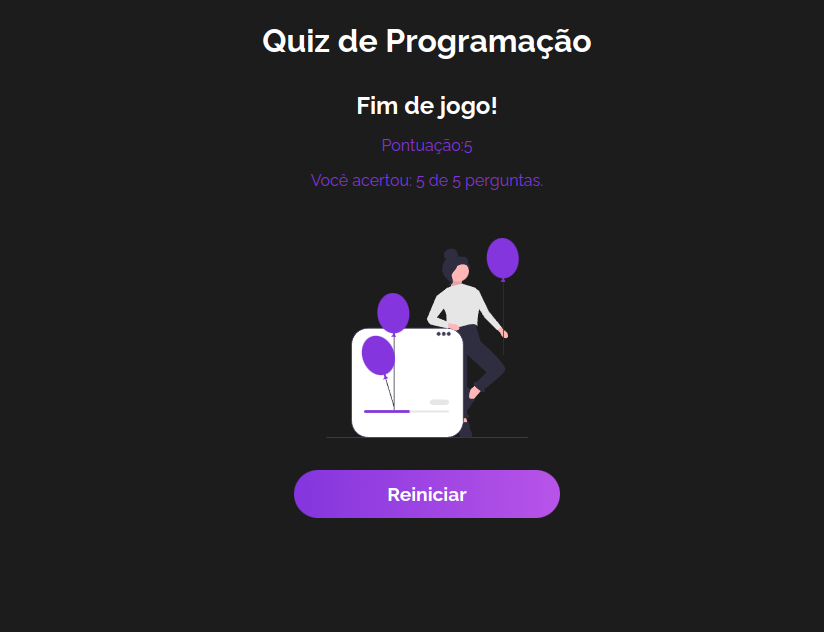

<h1 align="center">Quiz (React)</h1>

 

## 💻 Projeto

Projeto desenvolvido pelo **Matheus Battisti** do canal **Hora de Codar** e recriado para o treino das tecnologias utilizadas. Sendo esse meu primeiro projeto em React.

Link do video:

 

## 🚀 Tecnologias

Esse projeto foi desenvolvido com as seguintes tecnologias:

- HTML 
- CSS
- React

 
<h3 align="center">Tela Inicial</h3>

 
  

 

 
<h3 align="center">Acerto</h3>

 
  

 

<h3 align="center">Tela final</h3>

 
  

 

## Adicionais

- Também há sistema de pontuação
- Caso erre a opção correta será preenchida automaticamente